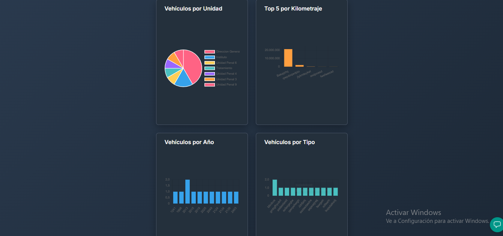
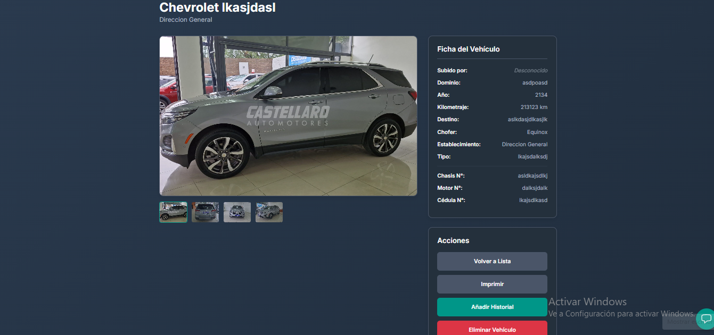
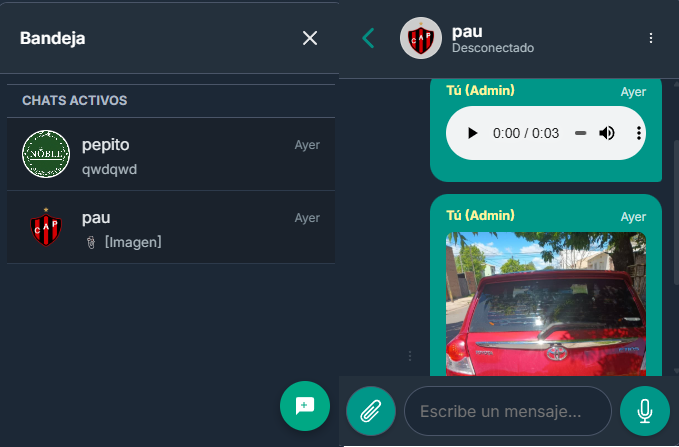
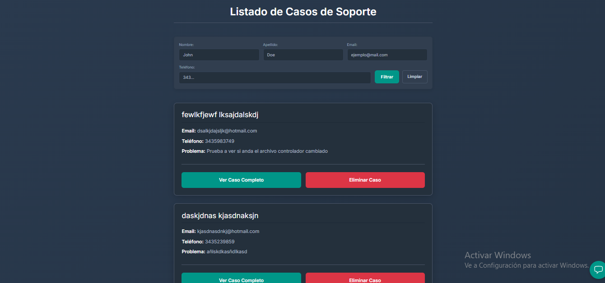
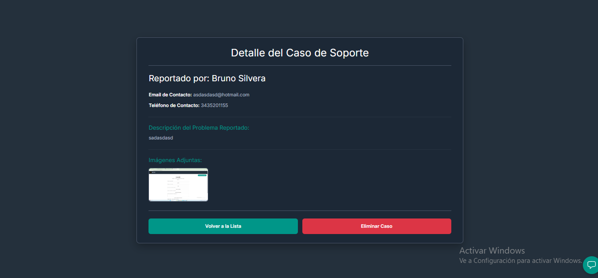

# 🚓 Control de Flota SPER


Sistema integral de gestión y administración de flota vehicular desarrollado para el **Servicio Penitenciario de Entre Ríos (SPER)**. Esta plataforma permite el seguimiento en tiempo real del estado, ubicación, mantenimiento y documentación de los vehículos oficiales, optimizando la logística y el control de recursos.

## 📋 Tabla de Contenidos
1. [Características Principales](#-características-principales)
2. [Arquitectura y Tecnología](#-arquitectura-y-tecnología)
3. [Capturas de Pantalla](#-capturas-de-pantalla)
4. [Instalación y Despliegue](#-instalación-y-despliegue)
5. [Testing y Calidad](#-testing-y-calidad)
6. [Estructura del Proyecto](#-estructura-del-proyecto)

---

## 🚀 Características Principales

* **Gestión Vehicular:** CRUD completo de unidades con historial detallado de kilometraje, reparaciones, services, choferes y documentación.
* **Soporte Móvil (Android):** Aplicación nativa (.apk) generada con Capacitor, permitiendo el uso en tablets y celulares de los oficiales en campo.
* **Control de Acceso (RBAC):**
    * *Administradores:* Control total sobre usuarios y flota global.
    * *Usuarios:* Acceso restringido únicamente a los vehículos de su unidad asignada (ej. UP1, UP3).
* **Sistema de Comunicación:**
    * Chat interno en tiempo real (Socket.io).
    * Sistema de Tickets de Soporte con capacidad de adjuntar evidencia multimedia.
* **Notificaciones Inteligentes:**
    * **Web:** Alertas visuales instantáneas (WebSockets).
    * **Android:** Notificaciones Push nativas mediante **Firebase Cloud Messaging (FCM)**, alertando incluso con la app cerrada.
* **Dashboard Estadístico:** Visualización de métricas de flota para la toma de decisiones estratégicas.

---

## 🛠 Arquitectura y Tecnología

El proyecto sigue una arquitectura de capas (**MVC + Services + Repository Pattern**) para asegurar escalabilidad y mantenibilidad.

### Backend
* **Runtime:** Node.js
* **Framework:** Express.js
* **Base de Datos:** PostgreSQL (vía Sequelize ORM)
* **Seguridad:** JWT (Auth) & Bcrypt (Hashing)
* **Almacenamiento:** Supabase Storage (Multimedia)
* **Tiempo Real:** Socket.io
* **Notificaciones:** Firebase Admin SDK (FCM)

### Frontend
* **Framework:** React (Vite)
* **Mobile Runtime:** Capacitor (CapacitorJS)
* **Plataforma:** Web & Android
* **Estilos:** CSS Modules + Bootstrap
* **Cliente HTTP:** Axios
* **PWA:** Capacidades progresivas para uso móvil.

### DevOps & QA
* **CI/CD:** GitHub Actions
* **Testing:** Jest & Supertest
* **Contenerización:** Docker
* **Despliegue:** Render (Backend) y Vercel (Frontend)

---

## 📸 Capturas de Pantalla

| Dashboard Principal | Gestión de Vehículos |
|:-------------------:|:--------------------:|
|  |  |

| Detalle de Unidad | Chat en Tiempo Real |
|:-----------------:|:-------------------:|
|  |  |

| Tickets de Soporte | Detalle de Caso |
|:------------------:|:---------------:|
|  |  |

---

## 💻 Instalación y Despliegue

### Requisitos Previos
* Node.js v18+
* PostgreSQL
* Android Studio (Solo para compilar la APK)

### Configuración Local

1.  **Clonar el repositorio**
    ```bash
    git clone [https://github.com/brunomps98/Control-de-Flota-SPER.git](https://github.com/brunomps98/Control-de-Flota-SPER.git)
    cd control-flota-sper
    ```

2.  **Configurar Backend**
    El proyecto incluye un archivo de plantilla con todas las variables necesarias.
    ```bash
    cd backend
    # Copiar la plantilla a un archivo .env real
    cp .env.example .env
    # Instalar dependencias
    npm install
    ```
    > ⚠️ **Importante:** Abre el archivo `.env` recién creado y completa tus credenciales reales (Base de datos, Claves JWT, Supabase, etc.).

3.  **Configurar Frontend**
    Regresa a la raíz y configura el cliente web:
    ```bash
    cd ../frontend
    # Copiar la plantilla
    cp .env.example .env
    # Instalar dependencias
    npm install
    ```
    > ⚠️ **Importante:** Verifica que la `VITE_API_URL` en el nuevo archivo `.env` coincida con el puerto de tu backend.

4.  **Ejecutar en Desarrollo**
    El proyecto cuenta con un script unificado. Desde la carpeta raíz, ejecuta:
    ```bash
    npm run dev
    ```
    *Este comando levantará simultáneamente el servidor Backend (puerto 8080) y el cliente Frontend.*

5.  **Compilar para Android**
    Si deseas generar la aplicación móvil:
    ```bash
    cd frontend
    npm run build
    npx cap sync
    npx cap open android
    ```
    *Esto abrirá Android Studio, desde donde podrás ejecutar la app en un emulador o dispositivo físico.*

---

## 🧪 Testing y Calidad

La calidad del código está asegurada mediante una suite de pruebas automatizadas que cubre tanto el **Backend** como el **Frontend**. Se utiliza **Jest** como motor principal, implementando **Mocks** para aislar dependencias externas.

### Cobertura

#### 🟢 Backend (Lógica y API)
* **Services:** Lógica de negocio pura (cálculos, validaciones, permisos).
* **Controllers:** Interacción HTTP y códigos de respuesta.
* **Middlewares:** Seguridad y validación de Tokens (JWT).
* **Utils & Repository:** Funciones auxiliares y abstracción de datos.

#### 🔵 Frontend (Componentes e Interfaz)
* **Componentes React:** Renderizado correcto de vistas críticas.
* **Interacción:** Simulación de eventos (clicks, formularios).
* **Integración:** Mocking de llamadas a Axios.

### Ejecutar Tests
Para correr las pruebas individualmente:

```bash
# Backend
cd backend && npm test

# Frontend
cd frontend && npm test

```

## 📂 Estructura del Proyecto

```bash

/control-flota-sper
├── backend
│   ├── src
│   │   ├── config          # Auth middleware, DB config, Supabase, Firebase
│   │   ├── controllers     # Lógica de Chat, Soporte, Dashboard
│   │   ├── models          # Modelos Sequelize
│   │   ├── repository      # Patrón Repositorio
│   │   ├── routes          # Definición de rutas Express API
│   │   ├── services        # Lógica de negocio compleja
│   │   ├── socket          # WebSockets (Socket.io)
│   │   ├── utils           # Helpers y encriptación
│   │   └── __tests__       # Tests unitarios y de integración
│   ├── app.js              # Configuración de Express
│   ├── server.js           # Punto de entrada del servidor
│   └── package.json
│
├── frontend
│   ├── android             # Proyecto nativo Android (Generado por Capacitor)
│   ├── src
│   │   ├── api             # Configuración Axios
│   │   ├── components      # Componentes Reutilizables
│   │   ├── context         # Estados globales (Auth)
│   │   ├── pages           # Vistas principales
│   │   ├── utils           # SweetAlert y formateadores
│   │   └── main.jsx         # Router principal
│   └── package.json
│
└── README.md               # Documentación del proyecto

```

👤 Autor
Bruno - Desarrollador Full Stack
